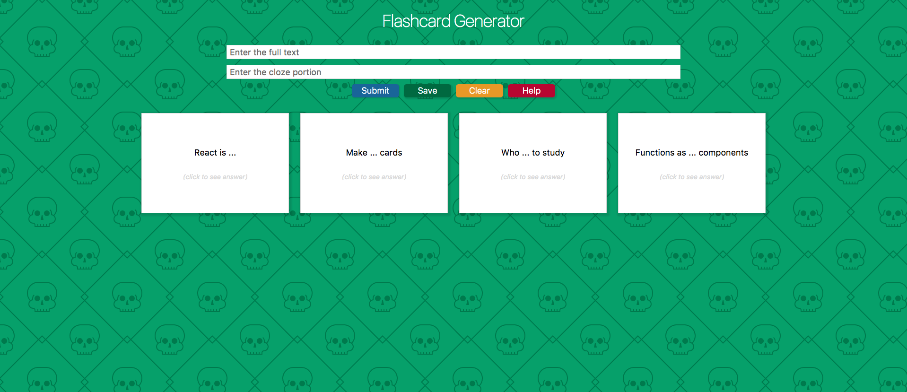

# Create flashcards with React!
The flashcard-generator is built on React to make it easy to create new study cards. The UI is simple and intuitive, and includes a section for getting help or more info if needed.

Once a user has created some flashcards, they can easily save them for later review. The app uses local storage and has a service worker, so the app completely functions offline!

The app is deployed to Firebase which makes deployment simple and seemless. [Try it out!](https://flashcard-generator-ddf65.firebaseapp.com/)

## Screenshots
**Making flashcards**

